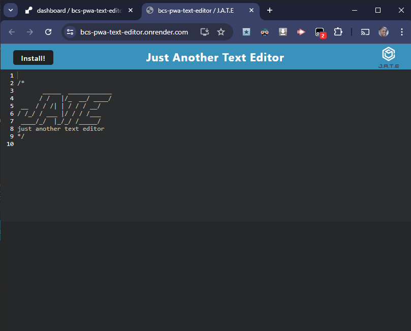

# My Project



## Description

This is a Progressive Web Application (PWA) Text Editor built with CodeMirror, IndexedDB, and localStorage. The application allows users to write and save text, which is stored in the browser's IndexedDB and localStorage for persistence.

[](https://bcs-pwa-text-editor.onrender.com)


### Task
I was given the following tasks to complete:

1. **Implement Asset Caching**
2. **Add and Configure Workbox Plugins for a Service Worker and Manifest File**
3. **Add CSS Loaders and Babel to Webpack**
4. **Add Logic to a Method that Accepts Some Content and Adds it to the Database**
5. **Add Logic for a Method that Gets All the Content from the Database**
6. **Add an Event Handler to the `beforeinstallprompt` Event**
7. **Implement a Click Event Handler on the `butInstall` Element**
8. **Add a Handler for the `appinstalled` Event**

<br>

## Table of Content
- [Features](#features)
- [Technologies](#technologies)
- [Getting Started](#getting-started)
- [Installation](#installation)
- [Usage](#usage)
- [Author](#author)
- [Questions](#questions)
- [License](#license)

<br>


## Features

- **CodeMirror Integration**: Provides a rich text editor with syntax highlighting, line numbers, and other features.
- **IndexedDB Storage**: Saves and retrieves data from the browser's IndexedDB.
- **LocalStorage Fallback**: Uses localStorage as a fallback if IndexedDB is not available.
- **PWA**: Can be installed as a Progressive Web Application.

<br>

## Technologies
Technologies used:
- **CodeMirror**
- **IndexedDB**
- **localStorage**
- **Express**
- **Webpack**

<br>

## Getting Started

This section will guide you through setting up the project locally. By the end of this guide, you will have a working version of My Project running on your machine.

### Prerequisites

Before you begin, ensure you have the following installed:

- [Node.js](https://nodejs.org/) (v14.0 or later)

- [Git](https://git-scm.com/)

- A text editor like [VSCode](https://code.visualstudio.com/)

<br>

## Installation
Follow these steps to get your development environment set up:
```bash
git clone https://github.com/febres0492/bcs-pwa-text-editor.git
cd bcs-pwa-text-editor
npm run install
```
<br>

## Usage
Follow these steps:
```bash
npm run start
```
<br>

## Author
Carlos Febres

<br>

## Questions
For questions please get in contant.  
Github Profile: https://github.com/febres0492  
Email: febres0492@gmail.com

<br>

## License

[](https://opensource.org/licenses/MIT)

This project is licensed under the MIT License - see the [LICENSE](https://opensource.org/licenses/MIT) for details.